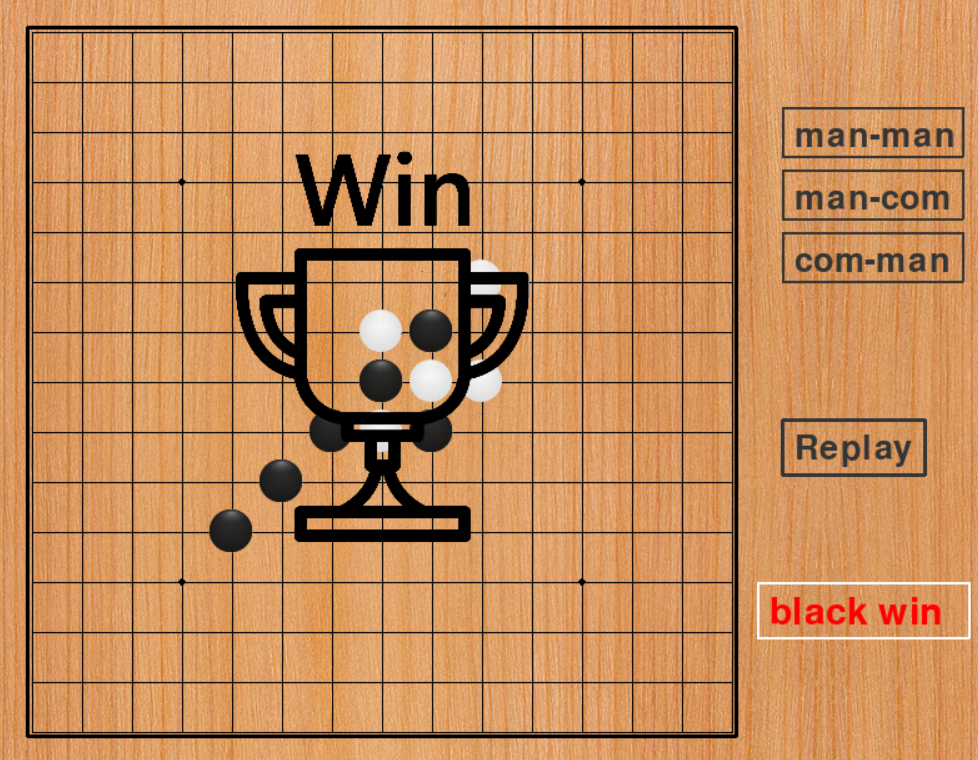

# 五子棋游戏
## 简介
### 五子棋本地联机及与电脑对战
## 环境
### python
## 实现功能
### 1.本地五子棋对战

### 2.与AI对战

### 3.有对应的获胜平局失败界面

### 4.有良好的人机交互界面

## 玩法
### 1.在右边栏选择模式，man-man代表本地对战；man-com代表人对战电脑，人先手；com-man代表人对战电脑，电脑先手
   

### 2.下方为replay按钮，可重新开始游戏
   

### 3.再下方为提示框，提示当前状态（下图意为轮到黑方下）
   

### 4.一局结束会弹出胜利或失败界面，点任意处可重新开始游戏
   

## 开发目的
### 1.	作为一名上班族，我想要在闲暇之余玩休闲的五子棋小游戏，以便于舒缓身心，减轻压力。
### 2.	作为一名玩家，我想要这款游戏有适当的难度，以便于增加游戏的可玩性和挑战性。	
### 3.	作为一名在聚会上的人，我想要与同学、亲人玩一玩五子棋小游戏，以便于增进友谊（亲情），增加聚会乐趣。

