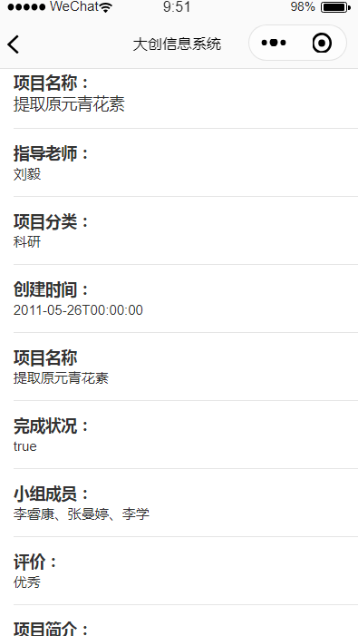

## 项目介绍
**此小程序为供师生交互大创项目的公共管理平台，标题栏为“大创信息系统”。**
主界面四大块组成，分别是优秀项目轮播图、优秀项目推荐以及操作栏。
在优秀项目轮播图中师生可以看到最醒目的几项优秀项目。如果继续将页面下拉还可以看到多个优秀项目，师生可以点击进入查看。

 **操作栏内可以通过点击“搜索”搜索想要获取的相关项目**
 

 **点击数据分析可以查看近几年大创项目的相关统计信息。**

 **可以通过点击“个人信息”进入“个人信息”界面；初始默认为学生，经过教师认证之后可以使用项目发布和我的项目功能**

 **在各个界面点击项目都会跳转到项目详细信息界面**

 **而点击教师会有下拉窗提供教师信息，可点击关注关注该老师，关注后可在我的关注界面查看**

