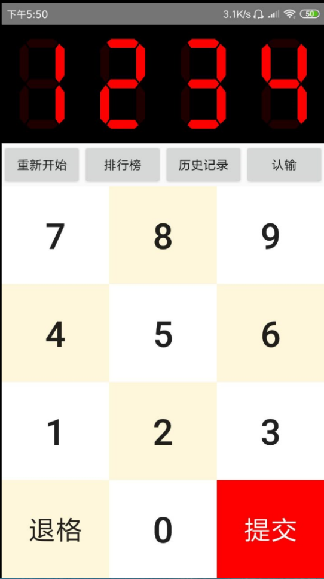
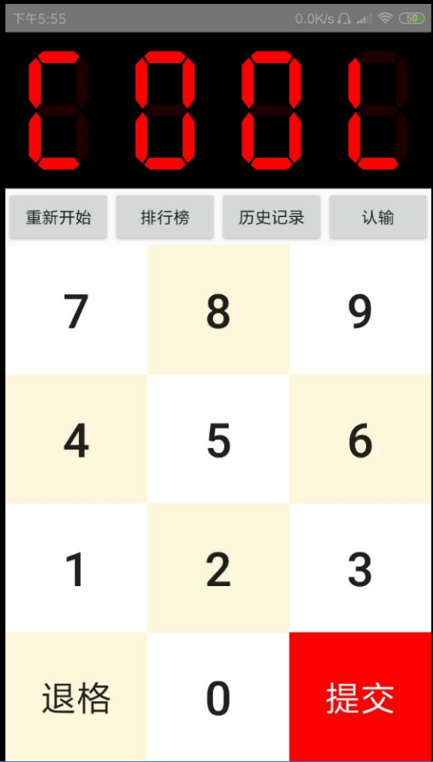

# **趣味游戏——猜数字**  

## **一、团队成员**
队名：对不队；  

队员：孙寒燚、吴新鹏、李剑豪。  
      
## **二、游戏介绍**
这是一款在Android端的猜数字小游戏App，是一款不可多得的益智类小游戏，度过闲暇时间的首选游戏。  
      
整个游戏共有四个界面，分别是：开始界面、规则界面、游戏界面以及结束界面。

 开始界面如上图所示，玩家可以选择“开始游戏”来进行游戏或者选择“游戏说明”来了解游戏规则。  
玩家点击“游戏说明”会出现完整的游戏规则如下图所示：

玩家可以先了解游戏规则之后再进行游戏，这样可以更快速进入游戏而不至于找不到游戏的乐趣。  
玩家点击“开始游戏”则会跳转到下图所示游戏界面：

玩家可以通过点击键盘上的数字来进行输入，输入错误的话可以点击“退格”来进行更正。如果确认自己的结果的话可以点击“提交”让系统判定是否正确。  
另外，玩家还可以点击“重新开始”来继续一局新的游戏。“排行榜”可以查看到历史的高分，假如玩家游戏进行不下去的时候可以点击“认输”按钮来结束这局困难的游戏。  
还有一个最重要的按钮是“历史纪录”，在这里我们可以看到本局游戏我们所有输入的数字以及结果，我们可以根据这些结果来推测最终的数字。  
如果最终玩家取得了胜利，那么游戏会跳转到结束界面，如下图所示：  

 玩家会看到显示屏上出现了“cool”，这样一局游戏就结束了，玩家也可以查看排行榜来看本次游戏是否出现在排行榜上了，这样的小游戏是不是很酷呢？

## **三、小结**
猜数字游戏是一个需要靠一点点逻辑思维来推理的小游戏，千万不要刚开始找不到思路就放弃了游戏，你可以多试几次找感觉，当你找到猜数字的方法后你一定会爱上这个游戏的！

