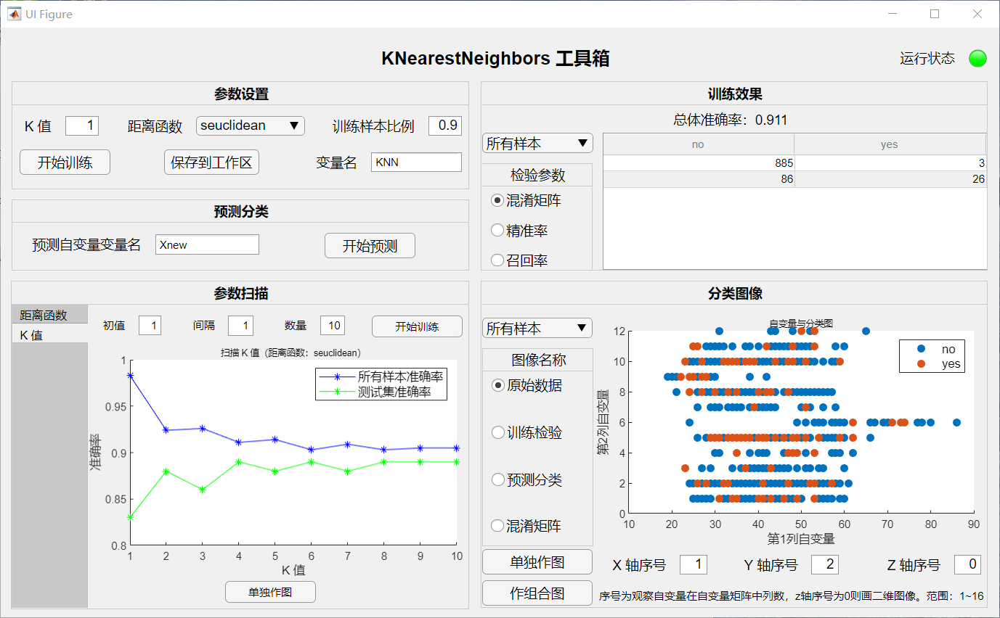

    <h1>
        MATLAB 数学建模工具箱总览
    </h1>

## 开发简介

- 本工具箱主要用于有关数学建模的 MATLAB 模型建立、求解、分析。将 MATLAB 自带的函数、类进行重新封装，生成新的类。
- 本项目相比 MATLAB 自带工具箱优势：
   - 只保留与数学建模相关的功能，扩展原来没有但是建模需要的功能，简洁，干货多。
   - 一键生成高质量分析图，用于模型分析。
   - 封装了大量参数扫描功能，用于模型建立。
   - 所包含内容都是最经典的一套建模思路，初学者可以对照学习。

## 完成模型

##### 详细介绍在gitHub地址 MathModelClass 具体的文件夹中，可进入查看

- 预测模型（predictionModel）
  - 线性回归模型（LinearRegression）
  - 时间序列函数拟合（FunctionTimeSeries）
  - 神经网络拟合（FitNet）
- 分类算法模型（classificationModel）
  - K 临近分析（KNearestNeighbors）
- 全局优化模型（optimizationModel）
  - 模拟退火算法（SimulatedAnnealing）

## 封装 APP

##### 下图为已经封装的APP，在对应的 MathModelAPP 中可查看具体使用说明。

## 使用环境

类可以在绝大多支持类的 MATLAB 版本中使用（只要不是太老的版本），APP 使用请下载 2019a。

将文件下载并添加到MATLAB路径即可使用。

##### 再次提醒：由于内容过多，请观看视频或者进入gitHub相应文件夹，里面含有详细介绍。

