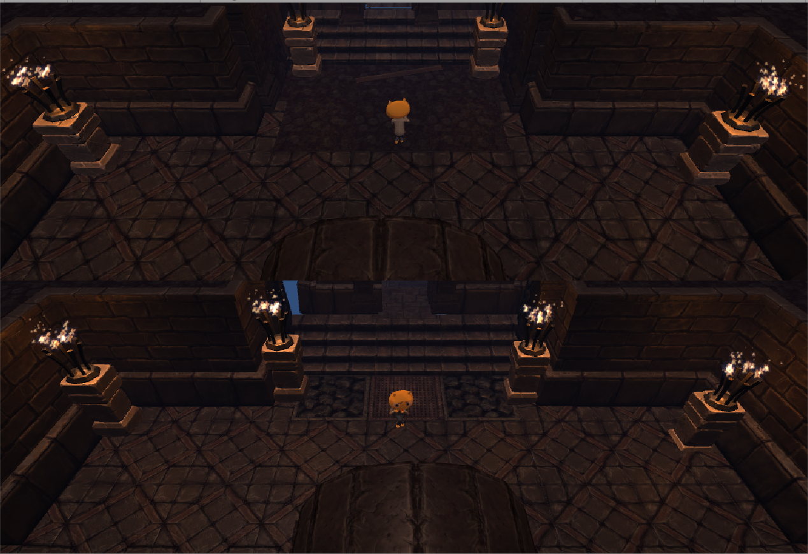

# Unity3D游戏——幽暗迷宫：寻宝
## 一、团队介绍
- 队名：阿飞的海鲜队
- 队员：李瑾立，凌章峻，欧阳秀峰
## 二、游戏介绍
- 本游戏是一款以迷宫为环境，以寻宝为目的，包含单人休闲及双人竞技游戏模式，并结合探险元素的一款3D游戏
- 本游戏分为单人模式和双人模式，单人模式侧重休闲；双人模式侧重竞技闯关，并有简单和困难两种难度等级可供玩家选择
- 单人模式使用方向键控制人物移动，双人模式使用wsad和方向键控制人物移动
- 本游戏的结束方式是找到迷宫中的宝藏
### 游戏菜单

### 单人模式

### 双人模式

### 宝物

### 怪物
- 石像鬼

- 骷髅兵

### 结束界面

## 结语
经过上面的叙述，你或许对这款游戏有了简单的了解，但是若想得到更多的游戏乐趣，获得更好的游戏体验，一定要实际尝试一下，在迷宫中找到最后的宝藏吧！

