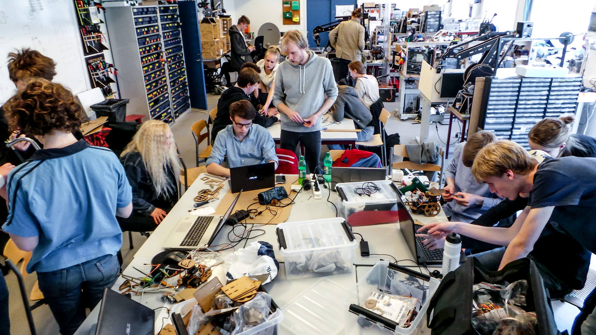

# 关于“我们的课程设计”

## TLDR:

我们的课程设计是一个非常简单的课程设计展示平台，简单到令人发指，甚至连搜索的功能都没有。

和github有啥区别？

根本就没有联系。这里是方便您找到、浏览各种课程设计，然后你可以跳转到对应的Github库。

这里就是按照学校，院系，不同的课程分类存放的课程设计展示。

我知道这就是你想要的。

## 这个网站存在的意义

每年，每年，都有大量的大学生在各种课程中完成课程设计。课程设计主要是锻炼、检验大家把课程中学到的理论知识应用于解决实际工程问题（或者类似的实际应用）的能力。所以课程设计本省是一个实际的工程项目，他是能够解决问题的，学生们通过学习和研发，提交的课程设计作品，实际上是一个真正的产品，完成一个真正的产品应该是一件非常有成就感的事情。但是大部分课程设计都去了哪？我们不回避这个问题，大部分都变成了废纸，去了档案柜或者是垃圾桶。辛辛苦苦做的东西，变成了没有用的东西，这个对学生积极性的打击是非常大的，严重降低了学生的成就感。有没有什么办法，让学生的毕业设计变得更加有用、更加有意义，让更人多了解认识这些作品，成为这个作品的用户呢？

有，就是通过这样一个“我们的课程设计”展示平台。这样所有学生的做平，就在互联网上向全世界公开了。学生的作品不再是默默无闻在档案柜里的报告，而是大家都可以使用、欣赏、把玩、参考、借鉴的作品。这对学生来说是一种成就、一种动力。大家都知道，现在驱动学生的动机大多数是分数，分数是外在动机（extrinsic motivation），效果大家都知道，问问难以实现我们让学生主动学习、探索、实践的目标。而这种让他的作品变得有用，让大家、真正的用户使用、认可、欣赏他的作品，这种成就感属于强大的内在动机（intrinsic motivation），这种等级是最好的动机。

当然，有人可能会说，这样会降低学生做平抄袭的难度，导致抄袭现象增多。我不这样认为。首先“开源（open source）”这种概念在工程领域存在了很久了，一直也在发展壮大，从source forge到GitHub，从软件到硬件，甚至到艺术，开源项目越来越多、开源社区也越来越活跃。在很多实际项目中，使用GitHub上的开源项目已经成为普遍现象。这个并不是抄袭，而实合理的运用资源。我们很多时候没有必要自己去造轮子，直接用别的的轮子就好了，只要我们能利用现有的轮子造出更好的车就行。工程、科学技术之所以能够快速发展，就是因为我们站在了前人的肩膀上。如果借鉴前人的经验、教训，激发我们的灵感，我们可以造出更好的产品和技术，我们为什么要回避这个呢。因此通过这个平台，大家可以方便的学习、参考、借鉴前人的作品，从而不断地提高课程设计作品的质量、创意，而不是每年都是重复，这也是课程设计更加有意思。  
同时我也相信，当自己的作品被别人所借鉴的时候，对自己来说也是一件非常有成就感的事情。而如果作品完全抄袭，毫无自己创意和努力，也是一个非常丢人的事，发假也不会在这个平台上展示这么丢人的作品，这是恰恰产生了一个反抄袭的内在动机。

对了，该平台展示的课程设计是关于的课程设计，然后值得分享的课堂项目，如海报、报告、PPT、艺术设计、视频作品，只要是某糖克重值得分享传播的都是这个平台收录的对象。

## 这个网站的未来

首先说一下这个网站的现在。现在确实是一个十分简单的网站，只能通过学校、学院、课程展示作品的基本信息，作品本身还是要依托GitHub或者类似的平台。不过这引进是最核心的功能了，现在拿出来给大家用主要也是希望通过大家的使用来得到反馈意见。这里先说一下，这个平台不会去实现GitHub已有的功能，这里仅仅是一个再集中展示的平台，不提供项目文件的管理。

然后再说一下以后的计划，就如同前面[这个网站存在的意义](#这个网站存在的意义)中说的，本网站的主要是让课设作品变得有用、有成就，为了这个目的未来会加入一下这些功能：  

1. 分享到社交平台
2. 点赞
3. 回复交流
3. 项目间引用管理  

## 联系我

Email：feedback@kshub.xyz

