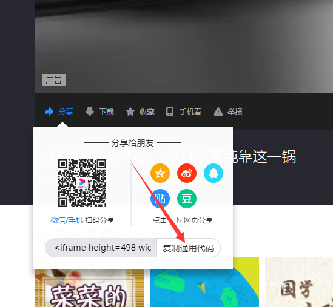

# 如何做一个项目展示

## TL;DR:
真的非常简单，就是写一个Markdown，Markdown就是一个非常简单非常好用的写文档的格式，我前列推荐给你们。  
然后你只需要改`meta.json`这个文件，用记例子文件中的MetaDataGet.exe图形界面修改就可以了。

## 项目展示是什么？
项目展示是一个文件夹，其中有一些文件里面包含您项目的信息，放在网上展示，其他的同学可以看到您的项目，从中学到知识。  
这个文件夹中分为3个主要的文件：  
1. content.md  
  这是你项目介绍的Markdown，是一个文本文件，就是您写一篇文章来展示您的项目，使用Markdown这种简单的格式后面有介绍。如果您用的是图片海报展示，同时觉得没啥好些的，可以保持这个文件空白。
2. meta.json  
这个是您项目的详细信息，包括您的项目名称、队员等等，怎么改在下文中有介绍
3. 各种海报图片  
如果您决定使用海报图片用来展示片，可以在meta.json把图片的文件名加入进去，在页面上会展示出来。
4. 其他文件  
如果您的markdown文件里面包含图片之类的，也需要放在这个文件夹中

## 项目介绍的Markdown
这个好像没什么好说的，可以参考[Markdown 语法说明][]。
写清楚就可以了，推荐使用[VSCODE](https://code.visualstudio.com/docs/languages/markdown)配合[图片粘贴插件](https://marketplace.visualstudio.com/items?itemName=mushan.vscode-paste-image)使用。  
**注意你写的项目展示的md文件文件名一定要是“content.md”**，放在你的项目文件建中就行，项目文件加就是把你所有东西都装起来的一个文件夹，里面还有你的项目介绍markdown文件、这个文件用到的图片、meta.json文件、**还有一个封面文件“cover，jpg”**。

这是一个图片：  


## meta.json怎么改？
**有一个简单方法，就是西在示例文件，解压，云心其中的MetaDataGet.exe就可以利用这个图形界面修改了。**

<!-- 下面的是给那个和玩家看的，您可以忽略。

1. 首先需要保证文件编码是Unicode，不然中文会乱码。  
unicode是啥？您不用管，您在例子文件上该就可以了。
1. 但是我还是在这里解释一下您需要修改的部分的意义：
```json
{
  "WebPath": "\\hustSample/seee/soft19\\work1",
  "Title": "这是一个例子，这里是项目的标题",
  "ChangeTime": "2019-07-31T17:13:09.7838032+08:00",
  "CreatedTime": "2019-03-24T22:45:57.0893043+08:00",
  "ViewedTimes": 0,
  "Template": "projectView",
  "Author": null,
  "Cover": "cover.jpg",
  "Extras": {
    "TeamName": "团队名称",
    "Abstract": "这里是您项目的摘要，请您写一段话介绍一下吧。不要太长400个字以内哦",
    "Teacher": "ָ指导老师的名字",
    "ProjectLink": "https://github.com/the-real-jushen/chibicms",
    "TeamMember": [
      "张队长",
      "这里填写上有团队成员的名字，队长名字请写第一个",
      "张三",
      "张四",
      "有几个写几个记得删掉"
    ],
    "Posters": [
      "1.jpg",
      "2.jpg",
      "有几个图片就写几条这个.jpg",
      "如果没有图片就删光中括号中间的.jpg"
    ],
    "EmbeddedVideo": "<iframe height=498 width=510 src='http://player.youku.com/embed/XNDI5NDQ3NjgyMA==' frameborder=0 'allowfullscreen'></iframe>"
  },
  "TopPath": "G:\\project\\Parallel\\ChibiCMSHust\\chibicms\\Code\\ChibiCmsWeb\\wwwroot\\contents\\hustSample/seee/soft19\\work1",
  "ContentType": "Content"
}
```
首先这是一个JSON file，是一种数据格式，不过不要怕，虽然这个是给机器看的数据，但是他设计的也是Human Readable的。
一般来说“：”前面的是字段名（key），后面的是值（value）。你只要改value就可以了，不要改其他的东西，改了就gg机器就不认识了。  
也不是所有的value都要改的，你一看就知道哪些要改，我这里再详细说一下。注意您只需要改引号里的东西，引号外面千万不要动：

* **Title**： 这里改成你项目的标题
然后下面很多都不用改，就是Extra下面的很多要改，
* **TeamName**：就是你给你团队起的名字
* **Abstract**: "这里是您项目的摘要，请您写一段话介绍一下吧。不要太长400个字以内哦",
* **Teacher**：指导老师的名字
* **ProjectLink**：这个很重要，这里填你香奴可以下载的东西的路径，一般是Github的链接，或这个百度网盘你项目文件的链接，可以是代码，ppt，论文，资料，图纸等等你想要别人下载的你想共享的东西。只能填一个链接哦，如果你有多个辅助的链接，可以放到content.md中。
* **TeamMember**： 这里写的是团队成员的名字，第一个名字将被认为是队长，这是个JSON的数据写法，记得每个元组写一行，这样你看着舒服些，然后每个元素后面是“,”分割的，最后一个元素后面没有。
* **Posters**：这个是你要展示的poster图片，和上一条一样是数组，你有几个图片就写几条，引号重视文件名，这个文件要房子啊你的项目文件夹中哦，就是和这个文件在一个文件夹中。如果没有图片就把中括号中间的内容删掉，不善好像也可以。
* **EmbeddedVideo**：这里可以写一个你的时评链接，请使用各种视频网站的iframe嵌入代码，例如下图：  
  
仅支持在这个位置展示一个视频，多的请插入到Markdown中。 -->

# [示例压缩包下载](project-sample.zip)，大家直接用这个压缩包里的改一下就可以了。

# 如何提交请点这里：[如何提交](/contents/kshub-projects/instructions/how-to-submit)

## 参考文献：
[Markdown 语法说明]:(https://m.w3cschool.cn/markdownyfsm/markdownyfsm-odm6256r.html)
[Markdown 语法说明] https://m.w3cschool.cn/markdownyfsm/markdownyfsm-odm6256r.html
